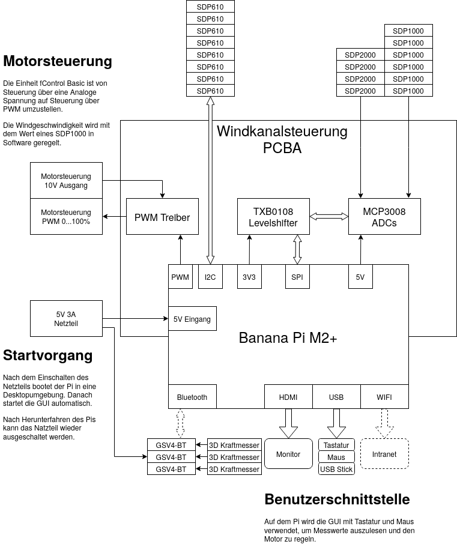
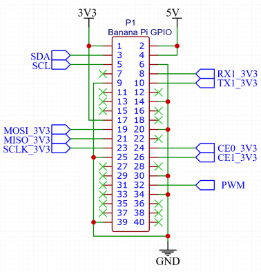

# Windkanal HSN




# Hardware
[PCB](https://easyeda.com/User201/windkanal)

[Gerber Dateien](hardware/pcb)

[Komponentenliste](hardware/bom.md)

## GPIO Pinout



# Installation
[software/install.md](software/install.md)

# Starten

```bash
cd software/
python3 main.py
```


# Entwicklung
[software/ui/README.md](software/ui/README.md)

## Guides
PyQt5 Tutorial https://likegeeks.com/pyqt5-tutorial/